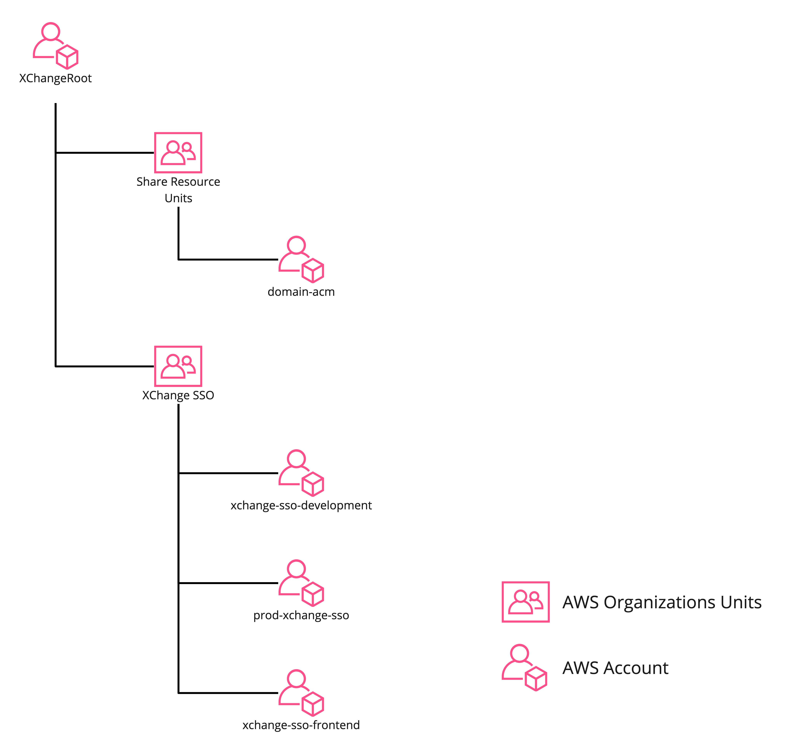

# XChange Single Sign-On System Architect

Contributors: [@chenkuansun](https://github.com/ChenKuanSun)
## Introduction

This project is a single sign-on system for XChange. Implemented by AWS CDK and all serverless framework.

## AWS Service and Resources 

1. [AWS CDK](https://docs.aws.amazon.com/cdk/latest/guide/index.html)

Use to deploy infrastructure and services.

2. [AWS Api Gateway v2](https://docs.aws.amazon.com/apigateway/latest/developerguide/what-is-api-gateway.html)

Use to create API Endpoints.

3. [AWS Lambda](https://docs.aws.amazon.com/lambda/latest/dg/welcome.html)

Handle the business logic.

4. [AWS Cognito](https://docs.aws.amazon.com/cognito/latest/developerguide/cognito-user-pools-create-user-pool.html)

Host the user pool.
Verify the user's identity.

5. [AWS DynamoDB](https://docs.aws.amazon.com/amazondynamodb/latest/developerguide/GettingStarted.DynamoDB.html)

Store the user's information, such as username, and other information for exchanging.
Store the federated identity information, such as FacebookID, GoogleID, etc.
Store authorization code for token endpoint,

6. [AWS CodePipeline](https://docs.aws.amazon.com/codepipeline/latest/userguide/welcome.html)

Single sign-on System Infrastructure continuously deploys and updates.

7. [AWS Amplify](https://aws.amazon.com/amplify/)

Hosted front-end for the single sign-on system.

8. [AWS Organizations](https://docs.aws.amazon.com/organizations/latest/userguide/orgs_manage_accounts.html)

Cross-account management, as follows:




## XChange Single Sign-On System Folder Structure
```
Root
├── code
│   └── lambda
│       ├── function
│       │   ├── Auth
│       │   ├── CognitoTriggerFunction
│       │   └── Oauth2
│       └── layer
│           └── auth
├── src
│   ├── helper
│   ├── stack
│   ├── stage
│   │   ├── backend.stage.ts
│   │   ├── frontend.stage.ts
│   │   └── layer.stage.ts
│   └── main.ts
...
```

Code folder contains all the backend logic code for the single sign-on system, including the Lambda functions, Cognito triggers, and OAuth2 related functions.

Src folder for AWS CDK Infrastructure, including stacks and stages. 

Main.ts is the entry point of the single sign-on system CDK.

## Getting Started

Requirements:

1. [Projen](https://github.com/projen/projen)
2. [AWS CLI](https://docs.aws.amazon.com/cli/latest/userguide/cli-chap-install.html)
3. [AWS CDK](https://docs.aws.amazon.com/cdk/latest/guide/index.html)

Run the following command :
```
npm/yarn install
npx projen
```

## System Manager Configuration

In order to deploy the single sign-on system, you need to configure the system manager.

Store parameters in the system manager as follows:
```
aws ssm put-parameter --overwrite --name "/account/sso/deployment" --type "String" --value "{Your deployment accountID}"  --profile={Your deployment accountID}  && \ 
aws ssm put-parameter --overwrite --name "/account/sso/prod/backend" --type "String" --value "{Your prod sso accountID}"  --profile={Your deployment accountID} &&\ 
aws ssm put-parameter --overwrite --name "/account/sso/frontend" --type "String" --value "{Your frontend accountID}"  --profile={Your deployment accountID} && \
aws ssm put-parameter --overwrite --name "/arn/sso/production/backend/wildcardXchangeDomain" --type "String" --value "{Your domain ACM ARN}"  --profile={Your deployment accountID}  && \
aws ssm put-parameter --overwrite --name "/arn/sso/production/backend/linkedInSecretManager" --type "String" --value "{Your LinkedIn Secret Manager ARN}"  --profile={Your deployment accountID} 
```

## Deployment

### Local deployment
If you use cross-account deployment, you need to set the environment variables.
```
export CDK_DEVELOPMENT_ARN="arn:aws:iam::{Your deployment accountID}:role/OrganizationAccountAccessRole"
```

then you can run the following command to deploy the single sign-on system code pipeline:
```
cdk deploy --all --profile={Your deployment accountID}
```

# Contributing

See [CONTRIBUTING](CONTRIBUTING.md) for more information.

# License
This code is licensed under the Apache License 2.0. See the [LICENSE](LICENSE) file.
